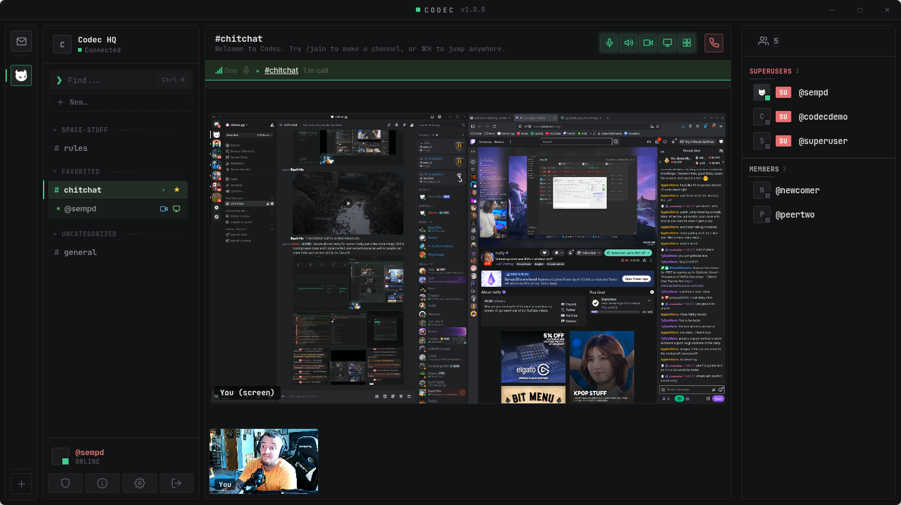

# Codec



**Self-hosted voice, video and text chat. You run the server; nobody else owns
the room.**

Codec is a desktop chat app and the server behind it. Spaces with their own
channels, roles and rules. Voice, video and screen sharing that go straight
between the people in the call. Direct messages that filter out strangers until
you say otherwise. And an admin panel that tells a server owner what is actually
happening on their instance, rather than leaving them to guess.

[**Download the latest release →**](../../releases/latest)

*Windows 11 users: Codec is unsigned, so Smart App Control blocks the installer.
[How to turn it off](#windows) — it takes about thirty seconds.*

---

## What it does

### Talk

- **Voice and video are peer-to-peer.** The server passes the introductions and
  then gets out of the way, which is why a small box can host a busy server.
- **Screen sharing with real audio** — up to 1080p60, 256kbps stereo, and a
  system-audio path on Linux that most clients do not have at all.
- **A call layout that matches how people watch one.** Shared screens fill the
  top; every camera runs along the bottom in one uniform strip. Double-click
  anything to blow it up, double-click to put it back.
- **You can see who is talking** — their row lifts, their tile takes a border.
- **Call controls sit next to the call button**, in every window a call can
  happen in, and appear only once a call is actually connected.

### Organise

- **Spaces** — your own community inside a server, with its own channels,
  categories, roles, bans and rules page.
- **Drag to arrange.** Channels between categories, categories into whatever
  order you want, and anything into Favorited to keep it at hand.
- **Every space keeps a `#rules` and a `#general`.** They can be renamed; they
  cannot be deleted out from under the people using them.
- **Anyone can make a channel.** Only the people running the space decide where
  it is filed.

### Messages

- **Message requests.** Anyone can write to you; a stranger's first message
  arrives as a request you read before accepting. Declining is quiet — they are
  not told, and they stop reaching you.
- **Images are compressed on the way in.** A 6.8MB photo is stored at around
  600KB, and the quality is walked down to a size budget rather than a fixed
  setting, so one detailed photo cannot cost twenty times what another does.
- **Click any picture** for a full-screen preview, with a button to open it in
  a browser.
- **History loads as you scroll**, fifty at a time, rather than pulling a
  channel's entire past on open.

### Run it

- **One binary, one SQLite file.** No database server, no runtime, no container
  required.
- **An admin panel worth opening** — who is online against how many connections,
  message volume over a fortnight, the busiest channels and people, live calls,
  storage and what compression saved.
- **Space accountability.** Open reports per space, how long the oldest has sat,
  and whether the space's own staff are clearing them or you are doing it for
  them.
- **A full audit log**, filterable by action and by person.
- **Reports** from any message, profile or channel, reaching that space's
  moderators and the server owner.
- **Switches that matter**: avatar uploads, image uploads, and the size limit,
  all changeable without a restart.

### The app

- **A terminal theme** — dark, monospace chrome, one accent colour.
- **Adjustable interface scale**, 80% to 150%.
- **A mobile layout that works**, with both side columns as drawers and every
  admin table folded into readable cards.
- **Self-updating**, both platforms, from this repository.

---

## Install

### Server

Linux x86-64. Root on a fresh Ubuntu or Debian box:

```bash
tar xzf codec-server-linux-amd64.tar.gz
sudo ./install.sh
```

It installs to `/opt/codec`, keeps data in `/var/lib/codec`, and starts a
systemd service called `codec` on port 6670.

**The first sign-in is `superuser` / `admin`, and you are made to change it
before you can do anything else.**

Put a reverse proxy in front of it, terminate TLS there, and point the client at
your domain. Example nginx:

```nginx
location / {
    proxy_pass http://127.0.0.1:6670;
    proxy_http_version 1.1;
    proxy_set_header Upgrade $http_upgrade;
    proxy_set_header Connection "upgrade";
    proxy_set_header Host $host;
    proxy_set_header X-Forwarded-For $proxy_add_x_forwarded_for;
    proxy_read_timeout 3600s;
}
```

The `Upgrade` headers are not optional — everything Codec does runs over a
WebSocket.

```bash
journalctl -u codec -f          # logs
/var/lib/codec/codec.toml       # config
systemctl restart codec         # after editing it
```

The server checks this repository for new releases every ten minutes and updates
itself.

### Windows

Download `Codec-Setup.exe` and run it.

Codec is not code-signed, so Windows will object. On Windows 11 with Smart App
Control on, the installer is blocked outright:

1. **Settings → Privacy & security → Windows Security → App & browser control**
2. **Smart App Control → Off**
3. Run the installer. On the SmartScreen prompt: **More info → Run anyway**

Smart App Control cannot be switched back on without reinstalling Windows, which
is Microsoft's decision rather than mine. If you would rather not, use the Linux
build or a VM.

### Linux

Download `Codec.AppImage`, then:

```bash
chmod +x Codec.AppImage
./Codec.AppImage
```

No install step. It updates itself in place.

---

## What it does not do

- **No hosted service.** There is no codec.com to sign up to. You run a server
  or you join someone else's.
- **No source code here.** This repository is the README and the releases.
- **No telemetry.** Nothing is sent anywhere except the server you connect to.
- **P2P calls show your IP** to the people in the call. That is how peer-to-peer
  works; if that matters to you, only call people you know.

---

## Licence

Codec is proprietary. It is free to download and use; the source is not
published. The full terms are in the app under **Settings → Terms of Use**.

Made by **Kevin Walters** (d3mon).
