<p align="center">
  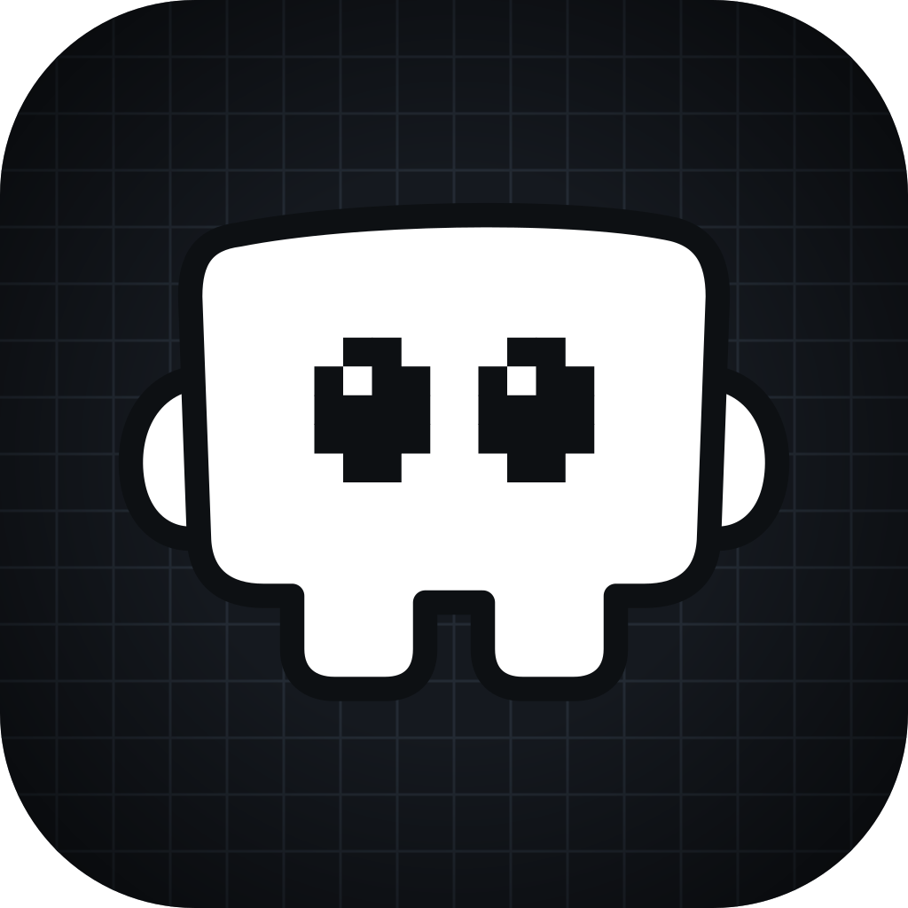
</p>

<h1 align="center">Codec</h1>

<p align="center"><b>Your voice. Your community. Your rules.</b><br>
Self-hosted voice, video and chat, laid out as a space you can move around in.</p>

<p align="center">
  <a href="https://codec.d3mon.gg"><b>Website</b></a> ·
  <a href="../../releases/latest"><b>Download</b></a> ·
  <a href="#android"><b>Android</b></a> ·
  <a href="#server"><b>Run a server</b></a>
</p>

<p align="center">
  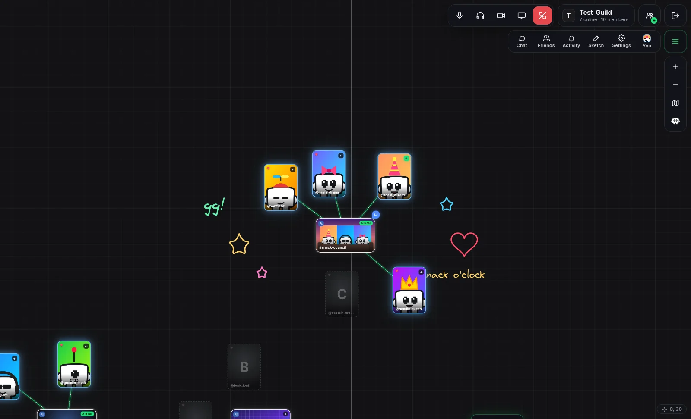
</p>

You run the server; nobody else owns the room. Everyone on it is a **card** in an
endless **space** — online, offline, or gathered around a **node** (a room with
its own call, chat and sketchpad). Voice, video and screen sharing go straight
between the people in the call; the server introduces them and gets out of the way.

[**Download the latest release →**](../../releases/latest)

*Windows 11 users: Codec is unsigned, so Smart App Control blocks the installer.
[How to turn it off](#windows) — it takes about thirty seconds.*

---

## Meet Byte

<p align="center">
  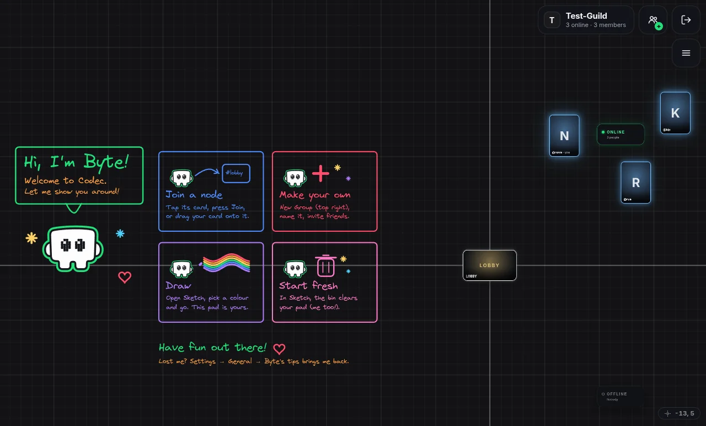
</p>

**Byte** is Codec's mascot: a chunky white block with pixel eyes. He's the icon
on your taskbar, in the title bar and on your phone, and he **lights up green
while someone in your call is talking**. The first time you sign in he's drawn on
your own sketchpad with a warm welcome, and his tips are scattered around the
grid for you to find — joining a node, making your own, drawing, and starting
fresh. Cleared him by accident? **Settings → General → Byte's tips** brings him
back.

---

## What it does

<table>
<tr>
<td width="50%">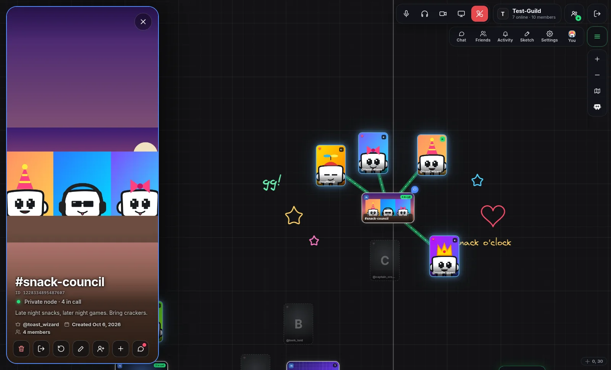</td>
<td width="50%">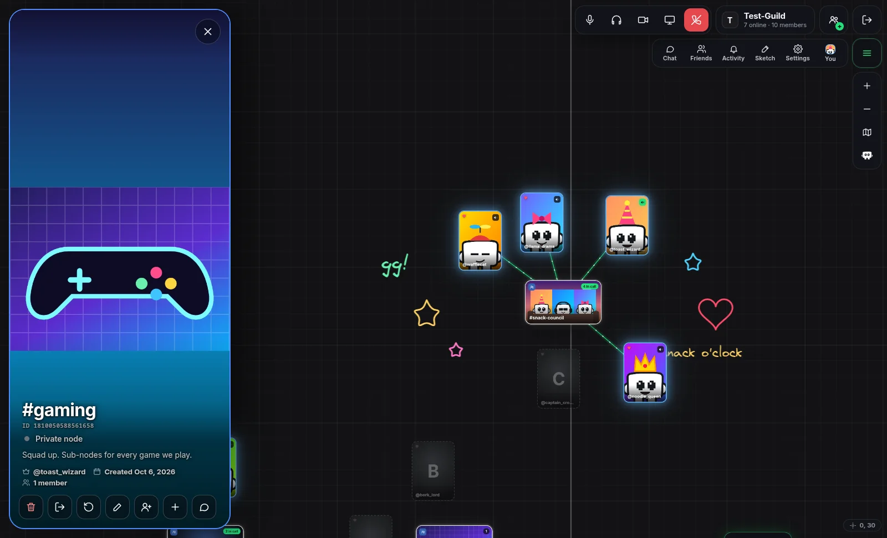</td>
</tr>
<tr>
<td><b>Nodes and Sub-Nodes.</b> Make a node, invite your friends, and it stays:
its people gather round it as cards, with its own call, chat and sketchpad.
Nodes can have Sub-Nodes; private ones are invite-only. Drag your card onto a
node to join its call.</td>
<td><b>Calls, cameras and streams on the cards.</b> Your camera and your shared
screen show on your card; streams can be pinned and resized. Peer-to-peer, with
noise suppression, a noise gate and echo cancellation — and your speaking light
shows exactly what is being sent.</td>
</tr>
<tr>
<td width="50%">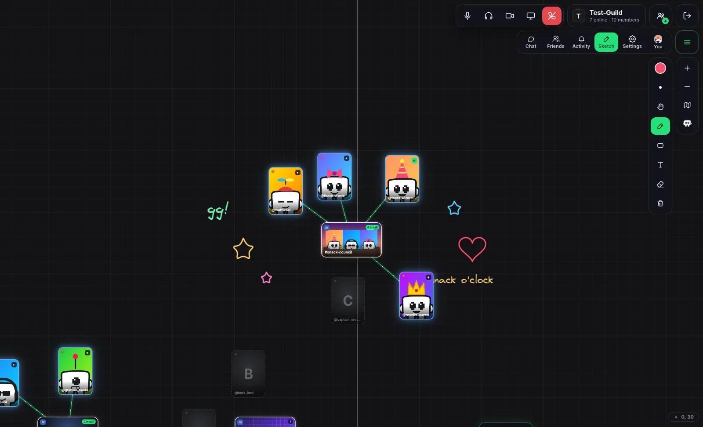</td>
<td width="50%">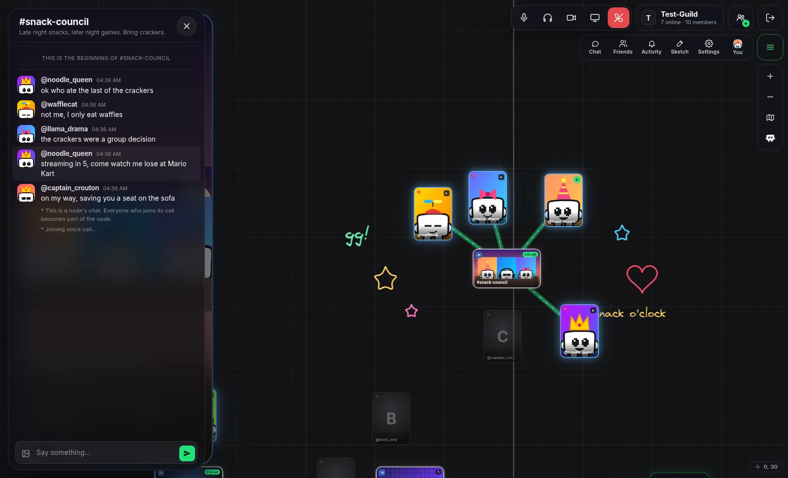</td>
</tr>
<tr>
<td><b>Sketch together.</b> Every call has a shared sketchpad — marker, shapes,
text and an exact eraser — and it's kept for next time. Your own pad is yours.</td>
<td><b>Chat and DMs.</b> Server chat, node chats and direct messages, with link
previews and pictures. Files go straight to the other person and land in your
DM to accept — remembered there, and shown on all your devices.</td>
</tr>
<tr>
<td width="50%">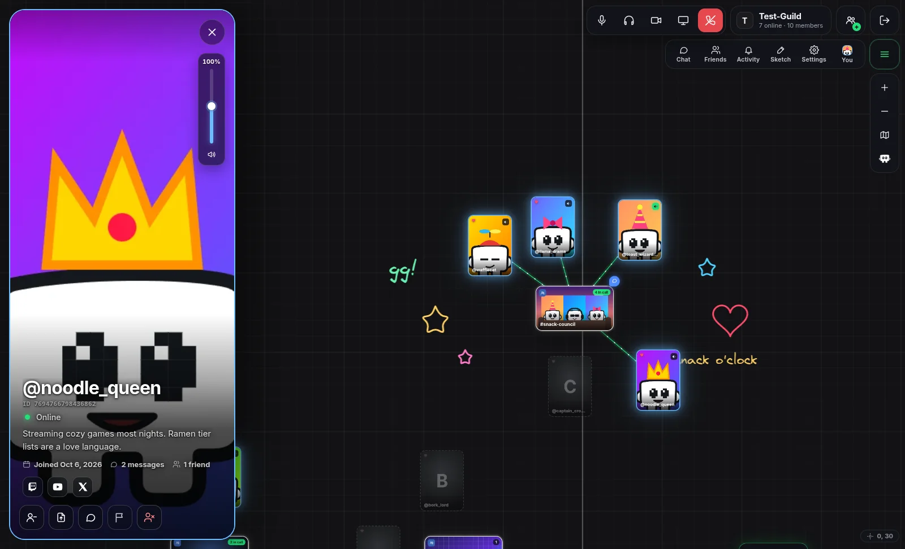</td>
<td width="50%">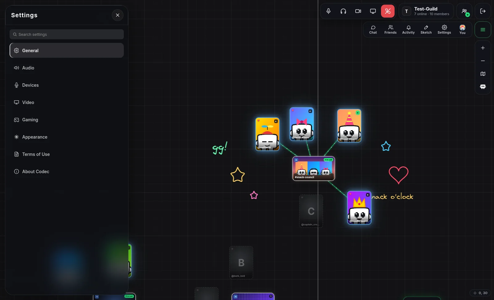</td>
</tr>
<tr>
<td><b>Profiles as trading cards.</b> Animated pictures, an about, social
links, and a rank colour on the border. Shake a friend's card to get their
attention.</td>
<td><b>Yours to run.</b> Ranks — Admin, Moderator, Operator (a node's owner),
Member — with an admin panel where you choose what each may do. Kick, ban,
reports, an audit log. Activity stays in step across your devices.</td>
</tr>
</table>

<p align="center">
  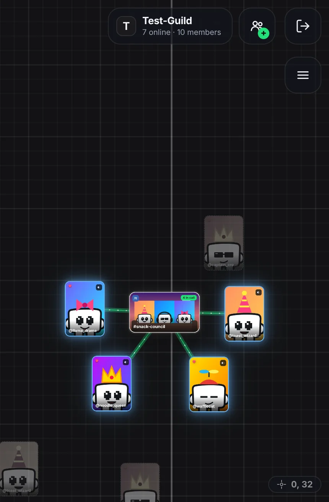
  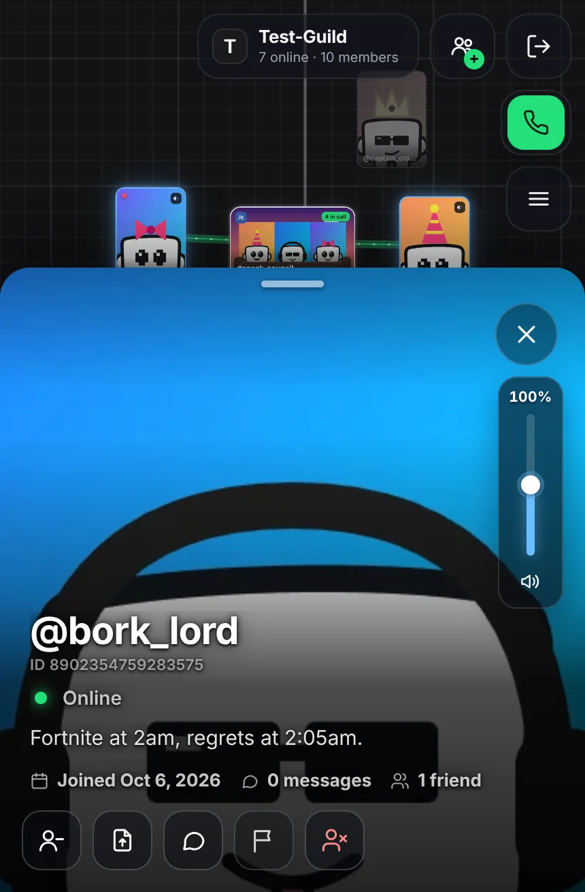
  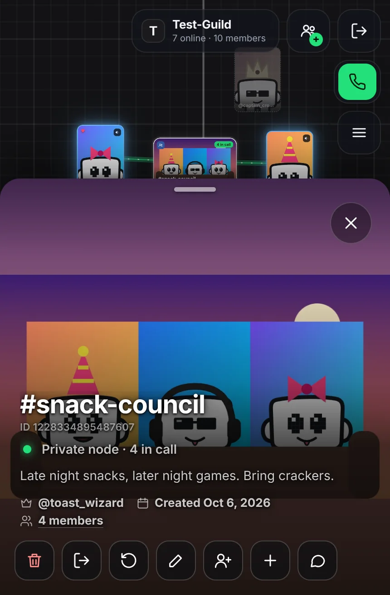
</p>

**The whole space, in your pocket.** The same Codec on Android — full screen,
calls that keep going in the background with a picture-in-picture call card,
and notifications for messages, calls and files.

---

## Install

### Windows

Download `Codec-Setup.exe` and run it. It updates itself.

Codec is not code-signed, so Windows will object. On Windows 11 with Smart App
Control on, the installer is blocked outright:

1. **Settings → Privacy & security → Windows Security → App & browser control**
2. **Smart App Control → Off**
3. Run the installer. On the SmartScreen prompt: **More info → Run anyway**

Smart App Control cannot be switched back on without reinstalling Windows, which
is Microsoft's decision rather than mine. If you would rather not, use the Linux
build or a VM.

### Linux

Download `Codec.AppImage`, then:

```bash
chmod +x Codec.AppImage
./Codec.AppImage
```

No install step. It updates itself in place.

### Android

Download `Codec.apk` from the [latest release](../../releases/latest) and open
it to install. It updates itself in place. Google Play is coming soon.

### Server

Linux x86-64. Root on a fresh Ubuntu or Debian box:

```bash
tar xzf codec-server-linux-amd64.tar.gz
sudo ./install.sh
```

It installs to `/opt/codec`, keeps data in `/var/lib/codec`, and starts a
systemd service called `codec` on port 6670.

**The first sign-in is `superuser` / `admin`, and you are made to change it
before you can do anything else.** Rename your server and set it up from the
admin panel (the shield at the top right).

Put a reverse proxy in front of it, terminate TLS there, and point the app at
your domain. Example nginx:

```nginx
location / {
    proxy_pass http://127.0.0.1:6670;
    proxy_http_version 1.1;
    proxy_set_header Upgrade $http_upgrade;
    proxy_set_header Connection "upgrade";
    proxy_set_header Host $host;
    proxy_set_header X-Forwarded-For $proxy_add_x_forwarded_for;
    proxy_read_timeout 3600s;
}
```

The `Upgrade` headers are not optional — everything Codec does runs over a
WebSocket.

```bash
journalctl -u codec -f          # logs
/var/lib/codec/codec.toml       # config
systemctl restart codec         # after editing it
```

---

## What it does not do

- **No hosted service.** You run a server or you join someone else's.
- **No source code here.** This repository is the README and the releases.
- **No telemetry.** Nothing is sent anywhere except the server you connect to.
- **P2P calls show your IP** to the people in the call. That is how peer-to-peer
  works; if that matters to you, only call people you know.

---

## Licence

Codec is proprietary. It is free to download and use; the source is not
published. The full terms are in the app under **Settings → Terms of Use**.

Made by **Kevin Walters** (d3mon) — and Byte.
